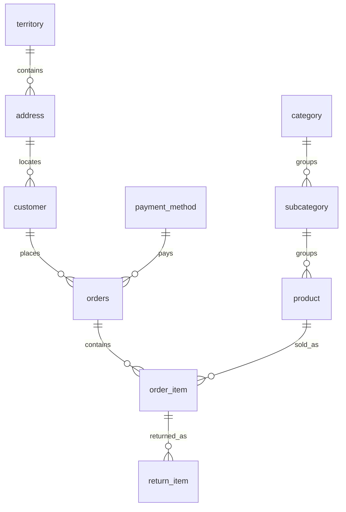

# Online Retail Database

A relational database for a retail business, with SQL reports for monthly sales, customer purchasing activity, discounts, and product returns.

Developed by **Mohammad Alseadoon and Khalid Alsaab** for the university **IT Database** class. This repository presents a polished edition of the coursework project, with a runnable database, documented design decisions, and automated tests.

**SQLite · SQL · Python · GitHub Actions**

## Run the project

Requires Python 3.9+ with its standard-library SQLite module. No extra packages or database server required.

```bash
git clone https://github.com/THE-MACHINE221/Online-Retail-DB.git
cd Online-Retail-DB
python3 demo.py
python3 -m unittest discover -s tests -v
```

The demo creates an isolated in-memory database, loads the dataset, and prints four analytical reports. Each run starts fresh and leaves no database file on disk.

## Dataset

A fixed, entirely synthetic retail scenario covering **January–December 2024**:

| Customers | Products | Orders | Sale lines | Return events |
|---:|---:|---:|---:|---:|
| 24 | 13 | 167 | 410 | 53 |

The catalogue spans clothing, accessories, and footwear. Transactions include multi-item baskets, one-time and repeat customers, per-unit discounts, returns in later months, multiple partial returns, and an unsold product. November includes a promotion scenario. All customer labels and transactions are fictional.

## Analytics highlights

| Question | Report | Example from the dataset |
|---|---|---|
| How do sales and refunds vary by month? | [Monthly net sales](sql/analytics/monthly_net_sales.sql) | December has the highest net sales: SAR 7,335.00 |
| How do order volume, basket value, and discounts vary? | [Monthly order activity](sql/analytics/monthly_order_activity.sql) | November: 20 orders, SAR 293.25 average order value, 15.31% weighted discount rate |
| Which products have higher unit return rates? | [Product return rates](sql/analytics/product_return_rates.sql) | Running shoes: 10 of 43 units returned (23.26%); cotton socks: 0 of 33 |
| Which customers buy more than once? | [Repeat customers](sql/analytics/repeat_customers.sql) | 21 repeat customers; the most frequent placed 19 orders |

These are observations within a designed learning dataset, not findings about an actual business. See [metric definitions and interpretation](docs/analytics.md) for full monthly results and analytical limitations.

## Data model



Ten tables separate customer and catalogue information from purchases and returns. Each sale line stores the unit price and discount at purchase time. Each return references the purchased line, preserving the correct refund amount even if catalogue prices change.

Money is stored as integer halalas. Constraints and triggers reject invalid values, impossible return dates, and returns exceeding purchased quantities. Views centralize sale and refund calculations; analytical queries aggregate at the correct level to avoid duplicated totals.

## Repository guide

| Path | Purpose |
|---|---|
| `sql/01_schema.sql` | Tables, constraints, indexes, and triggers |
| `sql/02_seed.sql` | Full-year synthetic retail dataset |
| `sql/03_views.sql` | Reusable sale and refund views |
| `sql/analytics/` | Four analytical SQL reports |
| `demo.py` | Database setup and formatted report runner |
| `tests/test_database.py` | Focused integrity checks and full-dataset reconciliation |
| `tests/fixture.sql` | Small, hand-checkable dataset for boundary tests |
| `docs/design.md` | Relationships, tradeoffs, and integrity rules |
| `docs/analytics.md` | Metric definitions, results, and interpretation |
| `.github/workflows/test.yml` | Runs the tests and demo on pushes and pull requests |

## Testing

Tests check known financial results, historical price stability, partial-return limits, invalid dates and values, foreign keys, immutable transaction records, and undefined return rates. Full-dataset checks independently reconcile the SQL reports with calculations over the underlying records. GitHub Actions runs the suite and demo in a fresh environment.

## Scope

Educational retail database using SAR. Tax, shipping, inventory, product variants, payment processing, authentication, and cancellation workflows are outside scope. Returns refund the original discounted unit price. This dataset is for demonstrating behavior rather than benchmarking production scale. See [design decisions](docs/design.md).

## Contributors

**Mohammad Alseadoon · Khalid Alsaab**  
University IT Database class project.

No open-source license is granted in this repository; public visibility alone does not grant reuse rights.
