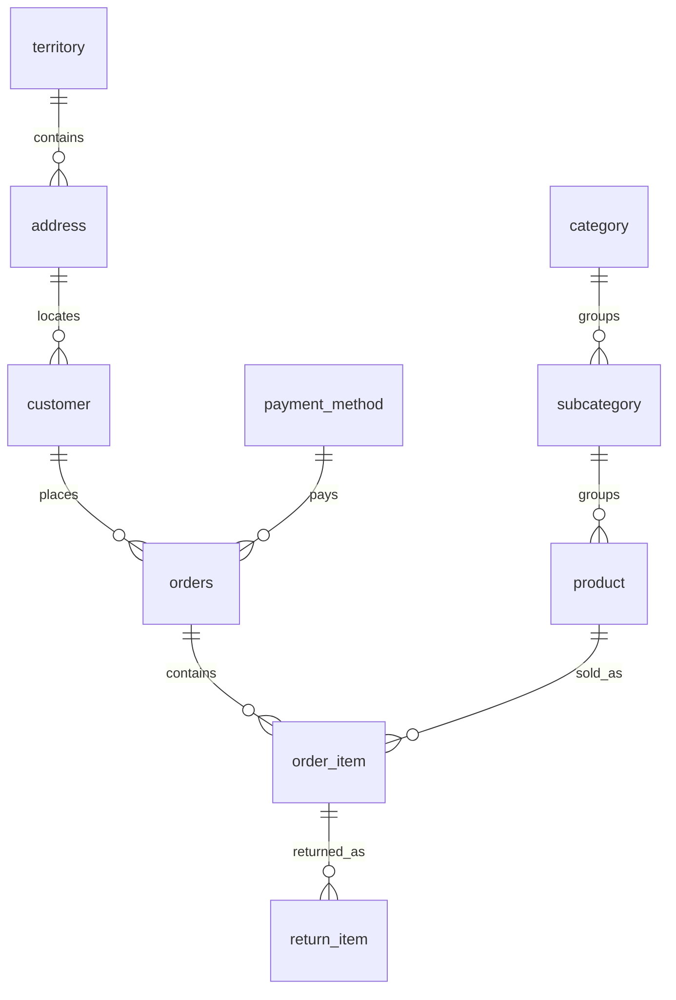

# Online Retail Database

[](https://github.com/THE-MACHINE221/Online-Retail-DB/actions/workflows/test.yml)

A retail database with SQL reports for sales, customer purchasing activity, discounts, and returns.

Developed by **Mohammad Alseadoon and Khalid Alsaab** for our university **IT Database** class.

**SQLite · SQL · Python · GitHub Actions**

## Run the project

Requires Python 3.9+ with its standard-library SQLite module. No extra packages or database server required.

```bash
git clone https://github.com/THE-MACHINE221/Online-Retail-DB.git
cd Online-Retail-DB
python3 demo.py
python3 -m unittest discover -s tests -v
```

Each run builds a fresh in-memory database and prints four reports. No database file is saved.

## Output preview

Selected rows from `python3 demo.py`; the full output includes all twelve months, every product, and repeat customers. Monetary amounts are in SAR; return rates are percentages.

```text
Monthly Net Sales
month   | sales_sar | refunds_sar | net_sales_sar
--------+-----------+-------------+--------------
2024-10 | 4609.00   | 427.50      | 4181.50
2024-11 | 5865.00   | 950.00      | 4915.00
2024-12 | 8429.50   | 1094.50     | 7335.00

Product Return Rates
product_id | product_name      | units_sold | units_returned | return_rate_pct
-----------+-------------------+------------+----------------+----------------
9          | Running shoes     | 43         | 10             | 23.26
11         | Cotton socks pack | 33         | 0              | 0.00
13         | Weekend duffel    | 0          | 0              | N/A
```

`N/A` indicates an undefined return rate for a product with no sales.

## Dataset and reports

Entirely synthetic transactions covering **January–December 2024**, across clothing, accessories, and footwear.

| Customers | Products | Orders | Sale lines | Return events |
|---:|---:|---:|---:|---:|
| 24 | 13 | 167 | 410 | 53 |

The data includes multi-item baskets, one-time and repeat customers, discounts, partial returns, and an unsold product. All records are fictional; results demonstrate the queries rather than real business performance.

| Report | What it answers |
|---|---|
| [Monthly net sales](sql/analytics/monthly_net_sales.sql) | How much remains after discounts and refunds? |
| [Monthly order activity](sql/analytics/monthly_order_activity.sql) | How do order volume, basket value, and discount rates vary? |
| [Product return rates](sql/analytics/product_return_rates.sql) | What share of each product's purchased units was returned? |
| [Repeat customers](sql/analytics/repeat_customers.sql) | Which customers placed more than one order? |

See [metric definitions and results](docs/analytics.md) for calculations and interpretation.

## Data model



Ten related tables separate customers and products from transactions. Sale lines retain purchase-time prices and discounts; returns reference the specific purchased line. See [design decisions and scope](docs/design.md) for integrity rules and tradeoffs.

## Explore the code

| Location | Purpose |
|---|---|
| [Schema](sql/01_schema.sql), [seed](sql/02_seed.sql), [views](sql/03_views.sql) | Database setup and reusable calculations |
| [Analytics](sql/analytics/) | Four SQL reports |
| [Demo runner](demo.py) | Builds the database and formats report output |
| [Tests](tests/test_database.py) | Calculation, integrity, and dataset checks using a [small fixture](tests/fixture.sql) and the full seed |
| [GitHub Actions](.github/workflows/test.yml) | Runs the test suite and demo on pushes and pull requests |

Educational scope: a single-currency retail database, without inventory, payment processing, or a storefront. Detailed assumptions and limitations are in the [design notes](docs/design.md).

No open-source license is granted in this repository; public visibility alone does not grant reuse rights.
