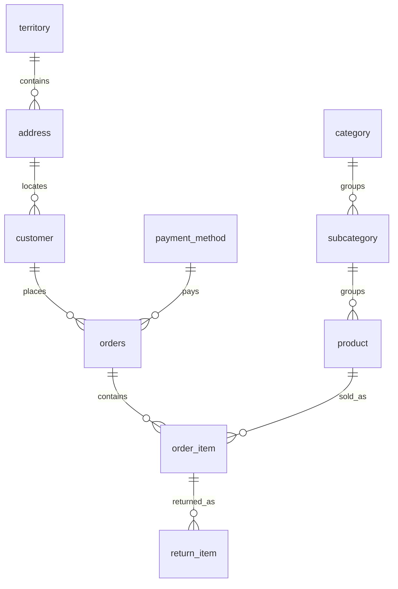

# Online Retail Database

A relational database project for a small retail store, with SQL reports for sales, discounts, returns, and repeat customers.

This started as a group project for an IT Database course. The GitHub version uses SQLite and builds on the original design with separate order items, returns linked to purchases, and four sales reports. It focuses on table relationships, constraints, views, and SQL queries.

## Tools:

**SQL, SQLite, and Python.**

The database and reports are written in SQL; Python loads the files and prints the results.

## Run the project

You need Python 3.9 or later. No extra packages or database server are required.

```bash
git clone https://github.com/THE-MACHINE221/Online-Retail-DB.git
cd Online-Retail-DB
python3 demo.py
```

Each run creates a temporary database, loads the sample data, and prints all four reports. No database file is saved.

## Database design

The database has ten tables. Customers place orders, each order contains product items, and each return refers to a purchased item.



- **Orders and items are separate:** one order can contain several products.
- **Sale prices are stored with each item:** changing a product's current price does not change earlier sales reports.
- **Returns refer to purchased items:** refunds use the price and discount from that purchase.
- **Amounts use whole halalas:** `5000` means SAR 50.00. Reports divide by 100 to show SAR.

See [database notes](docs/design.md) for table descriptions, normalization choices, and data rules. The schema checks keys, quantities, prices, discounts, and valid dates; cross-row return limits remain a documented assumption.

## Reports

| SQL file | Result |
|---|---|
| [Monthly net sales](sql/analytics/monthly_net_sales.sql) | Sales after discounts, refunds, and net sales by month |
| [Monthly order activity](sql/analytics/monthly_order_activity.sql) | Order counts, customer counts, average order value, and discount percentage |
| [Product return rates](sql/analytics/product_return_rates.sql) | Units sold, units returned, and return percentage for each product |
| [Repeat customers](sql/analytics/repeat_customers.sql) | Customers who placed at least two orders |

Example from the monthly net sales report (amounts in SAR):

```text
month   | sales_sar | refunds_sar | net_sales_sar
--------+-----------+-------------+--------------
2024-10 | 4609.00   | 427.50      | 4181.50
2024-11 | 5865.00   | 950.00      | 4915.00
2024-12 | 8429.50   | 1094.50     | 7335.00
```

The [report guide](docs/analytics.md) explains the calculations and SQL used in each report.

## Sample data

The data is fictional and covers January–December 2024:

| Customers | Products | Orders | Order items | Returns |
|---:|---:|---:|---:|---:|
| 24 | 13 | 167 | 410 | 53 |

It includes orders with several items, discounts, partial returns, repeat customers, and one product with no sales. Results are examples for practicing SQL, not findings about a real retailer.

## Files

```text
sql/
  01_schema.sql     Tables and basic constraints
  02_seed.sql       Sample data
  03_views.sql      Shared sales and refund calculations
  analytics/        Four report queries
  examples/         Basic insert, select, update, and delete example
docs/
  design.md         Tables and design notes
  analytics.md      Report calculations and SQL notes
demo.py             Loads the database and prints reports
```

To read the SQL, start with `01_schema.sql`, then `03_views.sql`. The repeat-customer query is the simplest report to start with.

The [basic operations example](sql/examples/basic_operations.sql) adds, reads, updates, and deletes a sample product. To run it in a SQLite editor, first load `01_schema.sql`, `02_seed.sql`, and `03_views.sql` in that order, then run the example. It ends with `ROLLBACK` to leave the sample database unchanged.

The project covers a single currency (SAR). Inventory, tax, shipping, and payment processing are outside its scope.

## Credits

Original university project: Mohammad Abdulkarim Alseadoon, Khalid Hamad Alsaab, Meshal Mohammed Almutairi, and Saleh Abdullah Alnoshan.
