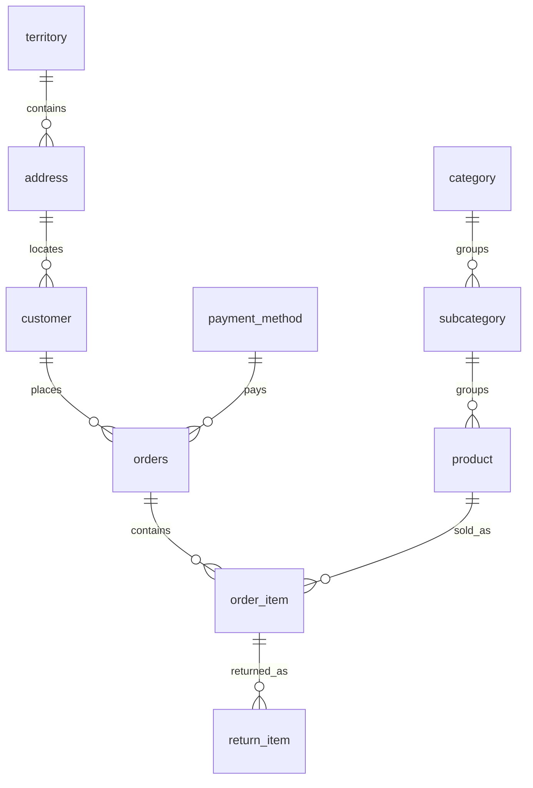

# Online Retail Database

Relational modeling and SQL analytics for a small retail business: customers, product categories, multi-item orders, discounts, and partial returns.

This is a **portfolio revision of a 2024 university database project**, originally developed by **Mohammad Alseadoon and Khalid Alsaab**. The original used Oracle-style SQL. This runnable revision uses SQLite, revises the transaction model, and includes a new, entirely synthetic dataset. It is an educational database project, not a production retail system or an employer case study.

## Run in under a minute

Requires Python 3.9+ with its standard-library SQLite module. No packages, account, or database server required.

```bash
git clone https://github.com/THE-MACHINE221/Online-Retail-DB.git
cd Online-Retail-DB
python3 demo.py
python3 -m unittest discover -s tests -v
```

The demo builds an isolated in-memory database each time and runs all analytical SQL files. It does not create or overwrite a database on disk.

## Business questions

| Question | SQL | Result from the synthetic fixture |
|---|---|---|
| How much did we sell after discounts and refunds each month? | [Monthly net sales](sql/analytics/monthly_net_sales.sql) | January: SAR 270; February: SAR 75 |
| Which customers placed more than one order? | [Repeat customers](sql/analytics/repeat_customers.sql) | Demo Customer 01: 2 orders |
| What share of purchased units was returned for each product? | [Product return rates](sql/analytics/product_return_rates.sql) | Shirts: 33.33%; trousers: 33.33%; bags: 0% |

These results demonstrate query behavior on a deliberately small fixture; they are not business findings. See [metric definitions and expected output](docs/analytics.md).

## Data model



The schema has ten tables. Each order item records its own sale-time unit price and discount. Each return references a specific purchased line, allowing multiple partial returns without losing the original purchase context.

## What this demonstrates

- Relational keys, referential integrity, constraints, and database triggers.
- Clear row-level meaning: one order header, one purchased line, one return event.
- SQL joins, views, CTEs, aggregations, and protection against duplicated totals.
- Historical prices that remain stable when the product catalogue changes.
- Reproducible setup and automated checks for financial calculations and invalid data.

## Original project and revision

The original project covered customers, territories, addresses, categories, subcategories, products, sizes, payment methods, orders, and returns, with DDL, DML, views, and normalization documentation. The [historical source section](original/README.md) preserves its schema, five views, and diagrams separately from the runnable revision.

This revision separates orders from their items, links returns to purchased items, stores money as integer halalas, and replaces the original sample data with synthetic records. Category-level sizing was omitted because it did not establish a valid product/size relationship; product variants are a future extension. See [design decisions](docs/design.md) for tradeoffs and limitations.

## Repository guide

| Path | Purpose |
|---|---|
| `sql/01_schema.sql` | Tables, integrity rules, indexes, and triggers |
| `sql/02_seed.sql` | Small synthetic fixture |
| `sql/03_views.sql` | Reusable sale and refund line views |
| `sql/analytics/` | Three standalone analytical queries |
| `demo.py` | Standard-library demo runner |
| `tests/` | Automated behavior and integrity checks |
| `docs/` | Design rationale and metric definitions |
| `original/` | Historical Oracle-style schema, views, diagrams, and source coverage |

## Scope and limitations

Single currency (SAR); no tax, shipping, inventory, payment processing, authentication, cancellation workflow, or production deployment. Returns are assumed to refund the original discounted unit price in full. Historical transaction records are immutable in this demo. The small dataset does not establish performance at scale. SQLite foreign-key enforcement must be enabled on every connection; the runner does so explicitly.

## Credits

- **Original project contributors:** Mohammad Alseadoon and Khalid Alsaab.
- **Portfolio revision:** prepared for Mohammad Alseadoon with AI assistance for restructuring, SQL implementation, documentation, and tests. The revision should not be attributed to the original team as work completed in 2024.

No student IDs, original reports, personal contact details, or employer data are included. No open-source license is granted in this repository; public visibility alone does not grant reuse rights.
